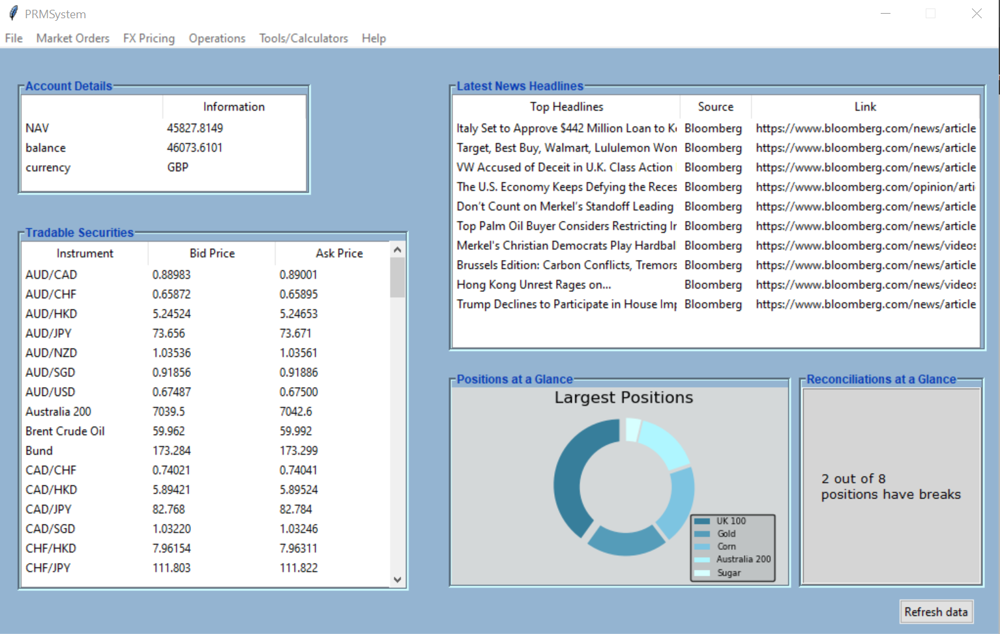

[![Forks][forks-shield]][forks-url]
[![Stargazers][stars-shield]][stars-url]
[![Issues][issues-shield]][issues-url]
[![MIT License][license-shield]][license-url]

# Portfolio Management Project (PRMSystem)
A basic porfolio management system written in Python's standard GUI package, Tkinter.

# Table of Contents
- [Introduction](https://github.com/RamonWill/portfolio-management-project#Introduction)
- [Installation](https://github.com/RamonWill/portfolio-management-project#Installation)
- [Features](https://github.com/RamonWill/portfolio-management-project#Features)
- [Credits](https://github.com/RamonWill/portfolio-management-project#Credit)
- [Video Demo](https://github.com/RamonWill/portfolio-management-project#Video-Demo)
- [Screenshots](https://github.com/RamonWill/portfolio-management-project#Screenshots)

# Introduction
This Project (PRMS) utilises the REST API's of Alpha Vantage to create charts with/without technical indicators and Oanda to execute trades to the market. PRMS also uses sqlite3 to store information from the Oanda platform into a database for reconciliation purposes. My main reason for using Tkinter was because its lack of "hand holding" meant that I had to create a lot of these features from scratch, i.e. the login and register pages and as well as the trade entry feature.

# Installation
If you do not have Python 3.7+, you can download it [here](https://www.python.org/downloads/release/python-370/, "here").

In the terminal navigate to the project directory and type `pip3 install -r requirements.txt`. This will install all the required modules to run this application.

API - Keys

This project requires 3 API keys:
* News API - Gets the latest news headlines. Get your key [here](https://newsapi.org/, "here").
* Oanda API - Various functions pertaining to the portfolio. Get your key [here](https://www1.oanda.com/register/#/sign-up/demo, "here").
* Alpha Vantage API - extract FX data for charting purpose. Get your key [here](https://www.alphavantage.co/, "here").

*** Note with Oanda you will also need to set up a dummy trading account with them to get your key.
Once you have your API keys and Oanda Account ID. populate them as strings in the config file.

When these processes have been completed you can then run the main application.

# Features
PRMS comes packed with the following features:
* View the latest news headlines
* Oanda Account details
* A list of all tradable securities as well as the live bid/ask prices
* Intraday FX Algorithm trading based on two strategies (Golden Cross, RSI)
* Intraday, Daily, Weekly FX Charting with Technical Indicators
* Buy/Sell Market Executions from the Oanda Platform. (with Trade confirmations)
* Transaction history and manual entry from the applications Database
* Position and Price reconciliation between Oanda and PRMS

# Credits
I'd like to thank [this answer](https://stackoverflow.com/questions/7546050/switch-between-two-frames-in-tkinter/7557028#7557028, "this answer") from Bryan Oakley on stack overflow that allowed me to design the layout and workflow of this project, without this it wouldn't be possible. 

I would also like to thank the Youtube channels [Sentdex](https://www.youtube.com/user/sentdex, "Sentdex") and [Derrick Sherril](https://www.youtube.com/channel/UCJHs6RO1CSM85e8jIMmCySw, "Derrick Sherril") for improving my knowledge on Python Libraries and demonstrating all of the things that can be done through Python.

[Here](https://gist.github.com/RamonWill/0422b061464097a7a0162f33e4c13a2e) is a gist i created. It is a rough template you can use if you want to create pages in the GUI as well as have a login page.

* Disclaimer: This project is not valid financial tool. It is a project that I've created to help me learn more about Python. You should in no way use it to make investment decisions.

# Video-Demo
The image below will redirect you to the video demo on Youtube

# Screenshots

[forks-shield]: https://img.shields.io/github/forks/RamonWill/portfolio-management-project.svg?style=for-the-badge
[forks-url]: https://github.com/RamonWill/portfolio-management-project/network/members
[stars-shield]: https://img.shields.io/github/stars/RamonWill/portfolio-management-project.svg?style=for-the-badge
[stars-url]: https://github.com/RamonWill/portfolio-management-project/stargazers
[issues-shield]: https://img.shields.io/github/issues/RamonWill/portfolio-management-project.svg?style=for-the-badge
[issues-url]: https://github.com/RamonWill/portfolio-management-project/issues
[license-shield]: https://img.shields.io/github/license/RamonWill/portfolio-management-project.svg?style=for-the-badge
[license-url]: https://github.com/RamonWill/portfolio-management-project/blob/master/LICENSE.txt
